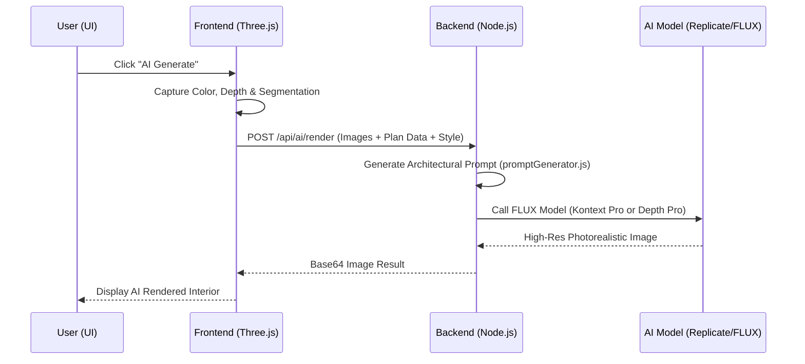

# AI Generation Architecture: End-to-End Process

This document outlines the complete technical process of how the **AI Interior Enhancer** works, from the moment a user clicks "Generate" to the final photorealistic output.

## 1. The Core AI Models
The system uses the **FLUX** family of models by Black Forest Labs, hosted on Replicate, to achieve state-of-the-art architectural visualization.

| View Type | Model Used | Reason |
| :--- | :--- | :--- |
| **Insider (FPS)** | `FLUX Kontext Pro` | Specialized for "layout-locked" editing. It takes the 3D screenshot and transforms the textures/lighting while keeping every object in its exact place. |
| **Perspective / 3D** | `FLUX.1 Depth Pro` | A depth-aware model. It uses the structural "skeleton" (depth map) of the 3D scene to generate a brand-new, high-fidelity interior that follows the room's geometry. |
| **Fallback** | `FLUX.1 Pro` | Used if depth/color reference is missing, generating images from text alone or standard img2img. |

---

## 2. The Step-by-Step Process

### Phase 0: Style Selection (UI)
The user selects a style from a visual gallery. Each style now features a **high-quality preview image** created by AI to represent the target color palette and furniture aesthetic. This helps you visualize the result before clicking generate.

### Phase 1: Scene Capture (Frontend)
When you click **"AI Generate"**, the system performs a multi-pass capture of the current 3D viewport using `AIRenderCapture.jsx`:
1.  **Color Render**: A high-resolution screenshot of the 3D model.
2.  **Depth Map**: A normalized grayscale map where white objects are "near" and black objects are "far". This provides the AI with the 3D structure.
3.  **Segmentation Map**: A color-coded map (e.g., Walls = Red, Furniture = Blue) that helps the AI identify exactly what each object in the scene is.

### Phase 2: Data Packaging
The frontend sends a request to the `/api/ai/render` endpoint containing:
*   The three captured images (Base64).
*   The **Plan Data**: A JSON summary of all walls and furniture items.
*   **User Preferences**: The chosen style (e.g., *Modern, Luxury, Scandinavian*) and room type.

### Phase 3: Architectural Prompt Engineering (Backend)
The backend `promptGenerator.js` transforms the raw data into a professional architectural prompt:
*   **Style Injection**: It adds keywords for specific materials (e.g., *"polished concrete, marble, light oak"*) and lighting (*"cinematic volumetric lighting"*).
*   **Inventory Mapping**: It scans the plan data and tells the AI: *"You are looking at a King Bed, two Nightstands, and a Wardrobe. Preserve their exact positions."*
*   **Quality Boosters**: It appends technical tokens like *"8k resolution, ray-tracing, Architectural Digest showcase"* to ensure a premium look.

### Phase 4: Model Execution (Replicate)
The `aiRenderService.js` selects the best model based on your camera angle:
*   **For Insider View**: It sends the **Color Render** to `FLUX Kontext Pro`.
*   **For Perspective View**: It sends the **Depth Map** to `FLUX.1 Depth Pro`.
*   The AI processes the request, replacing the "plastic" 3D textures with realistic fabrics, woods, and lighting.

### Phase 5: Result Delivery
The AI returns a high-definition JPG. The frontend receives this and displays the **AI Enhanced View**, allowing you to compare the original 3D model with the photorealistic vision.

---

## 3. Data Flow Diagram

---

## 4. Why This Approach?
*   **Structure Preservation**: By using Depth Maps and `Kontext Pro`, we ensure the AI doesn't "hallucinate" extra windows or move your furniture.
*   **Material Realism**: The AI "repaints" your scene. It understands that a flat gray box in Three.js is meant to be a *"Plush velvet sofa with realistic fabric folds."*
*   **Lighting Accuracy**: Instead of the basic web lighting, the AI simulates global illumination and realistic shadows pouring through your actual 3D window placements.
